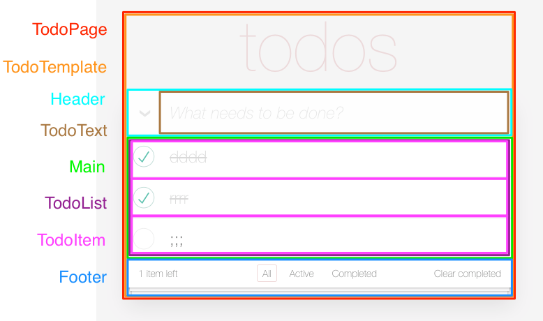

# Atomic React TodoMVC TDD Tutorial



1. [Atom](./atoms/README.md)
1. [Molecule](./molecules/README.md)
1. [Organism](./organisms/README.md)
1. [Template](./templates/README.md)
1. [Page](./pages/README.md)

## Installation

Install yarn if you don't have.

```shell
$ brew install yarn
```

or

```shell
$ npm install -g yarn
```

Clone [repository](https://github.com/kotarella1110/react-boilerplate "kotarella1110/react-boilerplate: Modern React Boilerplate based create-react-app 🚀").

Install package.

```shell
$ cd react-boilerplate
$ yarn install
```

## Quick Start

```shell
$ yarn storybook
$ yarn test
```
